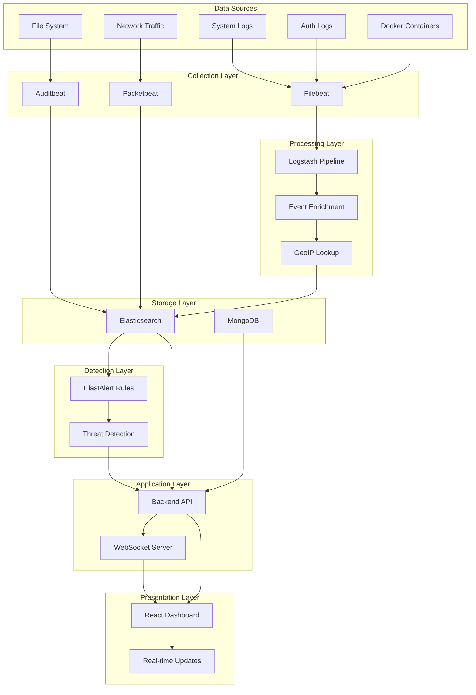
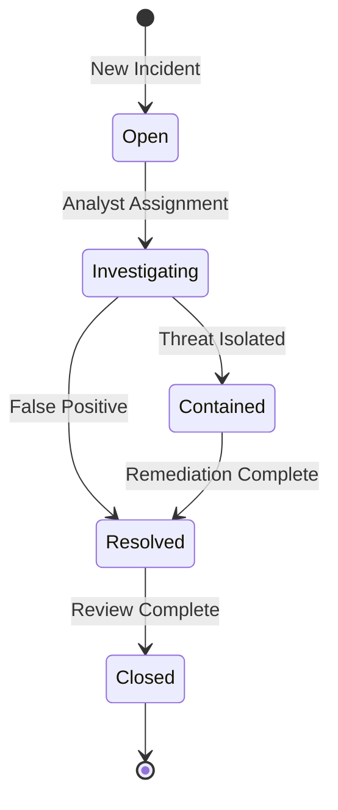

# 🔄 Security Incident Response Dashboard - Workflow Analysis

## Overview
This document provides a comprehensive analysis of the data flow and operational workflows within the Security Incident Response Dashboard system.

---

## 🎯 **Complete System Workflow**



---

## 📊 **1. Data Collection Workflow**

### **1.1 Log Collection Sources**
The system collects security data from multiple sources:

#### **System Logs** (via Filebeat)
- **Path**: `/var/log/syslog`
- **Type**: System events
- **Processing**: Real-time streaming to Elasticsearch
- **Index**: `filebeat-system-{date}`

#### **Authentication Logs** (via Filebeat)
- **Path**: `/var/log/auth.log`
- **Type**: Authentication events
- **Processing**: Pattern matching for security events
- **Index**: `filebeat-auth-{date}`

#### **Docker Container Logs**
- **Path**: `/var/lib/docker/containers/*/*.log`
- **Processing**: JSON parsing with Docker metadata enrichment
- **Index**: `filebeat-docker-{date}`

#### **Network Traffic** (via Packetbeat)
- **Monitoring**: Real-time packet capture
- **Protocols**: HTTP, DNS, TLS, etc.
- **Analysis**: Connection patterns, anomalies

#### **File Integrity** (via Auditbeat)
- **Monitoring**: Critical system files
- **Path**: `/etc/*` and other configured directories
- **Detection**: Unauthorized modifications

### **1.2 Collection Flow**
```
1. Beats agents continuously monitor configured sources
2. Events are collected and tagged with metadata
3. Data is shipped to either:
   - Logstash (for complex processing)
   - Elasticsearch (for direct indexing)
```

---

## 🔧 **2. Event Processing Pipeline**

### **2.1 Logstash Processing Stages**

#### **Input Stage**
```conf
- Beats input (port 5044)
- TCP/UDP JSON input (port 5000)
- File input (syslog, auth.log)
```

#### **Filter Stage - Security Event Detection**
The pipeline identifies and categorizes security events:

| Event Pattern | Security Classification | Severity |
|--------------|------------------------|----------|
| `Failed password` | failed_login | medium |
| `Accepted password` | successful_login | low |
| `Invalid user` | invalid_user | high |
| `sudo` command | sudo_command | medium |

#### **Enrichment Process**
1. **Timestamp Parsing**: Standardizes time formats
2. **GeoIP Lookup**: Maps IP addresses to locations
3. **Field Addition**: Adds hostname, log_type, severity
4. **Event Categorization**: Assigns security_event type

#### **Output Stage**
```conf
- Primary: Elasticsearch (security-logs-{date})
- Alert Webhook: Backend API (high/critical events)
```

### **2.2 Data Flow Example**
```
SSH Failed Login → Filebeat → Logstash → 
  → Parse message
  → Detect "Failed password"
  → Add severity: "medium"
  → Add security_event: "failed_login"
  → GeoIP lookup on source IP
  → Index to Elasticsearch
  → If severity=high, webhook to Backend
```

---

## 🚨 **3. Detection & Alerting Workflow**

### **3.1 ElastAlert Rules Engine**

#### **Failed Login Detection**
```yaml
Trigger: 3 failed attempts in 2 minutes
Query: auth_message:*Failed*password*
Action: Generate alert
```

#### **SSH Brute Force Detection**
```yaml
Trigger: 10 failures in 5 minutes from same IP
Query: SSH failures grouped by source.ip
Action: Alert with source IP
Cooldown: 30 minutes per IP
```

#### **Port Scan Detection**
```yaml
Trigger: Multiple connection attempts
Pattern: Rapid sequential port access
Action: Network threat alert
```

#### **Network Stress Detection**
```yaml
Trigger: Abnormal traffic patterns
Metrics: Packet rate, bandwidth usage
Action: Performance alert
```

### **3.2 Alert Processing Flow**
```
1. ElastAlert queries Elasticsearch every minute
2. Matches events against rule conditions
3. Aggregates events within timeframe
4. Triggers alert if threshold exceeded
5. Sends notification to configured channels
6. Applies cooldown period to prevent spam
```

---

## 📝 **4. Incident Management Workflow**

### **4.1 Incident Creation**

#### **Manual Creation** (via Dashboard)
```javascript
User Input → Frontend Form → 
  → API POST /api/incidents
  → Validate fields (title, severity, category)
  → Create MongoDB document
  → Emit WebSocket event
  → Update dashboard in real-time
```

#### **Automated Creation** (from Alerts)
```javascript
High Severity Alert → Logstash Webhook →
  → Backend /api/alerts/webhook
  → Auto-create incident
  → Assign to analyst pool
  → Send notifications
```

### **4.2 Incident Lifecycle States**


### **4.3 Incident Data Model**
Key fields tracked for each incident:
- **Identification**: title, description, category
- **Assessment**: severity (low/medium/high/critical)
- **Timeline**: detectedAt, reportedAt, resolvedAt
- **Impact**: affectedSystems, affectedUsers, financialImpact
- **Evidence**: logs, screenshots, network captures
- **Response**: timeline of actions, assignedTo
- **Learning**: lessonsLearned, recommendations

### **4.4 Incident Update Workflow**
```
1. Analyst updates incident status
2. Backend validates permissions
3. Update MongoDB document
4. Add entry to incident timeline
5. Emit WebSocket event
6. Refresh all connected dashboards
7. Trigger notifications if critical
```

---

## 👤 **5. User Interaction Workflow**

### **5.1 Authentication Flow**

#### **Login Process**
```javascript
1. User submits credentials
2. Backend validates email/password
3. Check user.isActive status
4. Generate JWT token (30 days)
5. Update lastLogin timestamp
6. Return token + user profile
7. Frontend stores token in localStorage
8. Include token in all API requests
```

#### **JWT Token Structure**
```json
{
  "id": "user_mongodb_id",
  "iat": 1693526400,
  "exp": 1696118400
}
```

### **5.2 Authorization Levels**

| Role | Permissions |
|------|------------|
| **Admin** | Full system access, user management, configuration |
| **Analyst** | Create/update incidents, view all data, generate reports |
| **Viewer** | Read-only access to dashboard and incidents |

### **5.3 Session Management**
```javascript
Token Validation → Every API Request →
  → Extract Bearer token
  → Verify JWT signature
  → Check expiration
  → Load user from MongoDB
  → Attach to request context
  → Proceed or reject (401)
```

---

## 🔄 **6. Real-time Update Workflow**

### **6.1 WebSocket Connection**
```javascript
1. Frontend establishes Socket.IO connection
2. Authenticate with JWT token
3. Join 'dashboard' room
4. Subscribe to event streams
```

### **6.2 Event Broadcasting**
```javascript
Incident Created → Backend →
  → io.to('dashboard').emit('incidentCreated', data)
  → All connected clients receive update
  → Frontend updates state
  → Re-render affected components
```

### **6.3 Real-time Events**
| Event | Trigger | Update |
|-------|---------|--------|
| `incidentCreated` | New incident | Add to list, update stats |
| `incidentUpdated` | Status change | Update incident, refresh counts |
| `alert` | New security alert | Show notification, update alert panel |
| `statsUpdate` | Metrics change | Refresh dashboard charts |

---

## 📈 **7. Dashboard Visualization Workflow**

### **7.1 Data Aggregation**
```javascript
GET /api/dashboard/stats →
  → Query MongoDB for incidents
  → Aggregate by status, severity
  → Calculate trends (24h, 7d, 30d)
  → Query Elasticsearch for log metrics
  → Combine and return statistics
```

### **7.2 Visualization Components**

#### **Statistics Cards**
- Total incidents
- Open incidents
- Critical severity count
- Resolution rate

#### **Charts**
- **Pie Chart**: Severity distribution
- **Bar Chart**: Status overview
- **Line Chart**: Incident trends
- **Heat Map**: Activity by hour

#### **Geographic Map**
- Incident locations from GeoIP
- Clustered markers for density
- Popup details on click

### **7.3 Auto-refresh Strategy**
```javascript
- Initial load on mount
- WebSocket updates (real-time)
- Periodic refresh (5 minutes)
- Manual refresh button
```

---

## 🔐 **8. Security Workflow**

### **8.1 Input Validation**
```javascript
All API Endpoints →
  → Validate request body
  → Sanitize strings
  → Check data types
  → Verify enum values
  → Return 400 if invalid
```

### **8.2 Rate Limiting**
- **General API**: 100 requests/15 minutes
- **Auth endpoints**: 20 requests/10 minutes
- **Per IP tracking**: Prevents brute force

### **8.3 Security Headers** (via Helmet.js)
- Content Security Policy
- X-Frame-Options: DENY
- X-Content-Type-Options: nosniff
- Strict-Transport-Security

---

## 🚀 **9. Deployment Workflow**

### **9.1 Container Orchestration**
```yaml
1. docker-compose up -d
2. Services start in dependency order:
   - Elasticsearch → healthy
   - MongoDB → started
   - Logstash → after Elasticsearch
   - Backend → after databases
   - Frontend → after Backend
   - Beats → after Elasticsearch
   - ElastAlert → last
```

### **9.2 Health Checks**
Each service includes health monitoring:
- **Elasticsearch**: HTTP check on port 9200
- **MongoDB**: mongosh ping command
- **Backend**: Custom healthcheck.js
- **Automatic restart**: on-failure policy

### **9.3 Data Persistence**
```yaml
Volumes:
- elasticsearch_data: Index storage
- mongodb_data: Incident database
- elastalert_data: Rule state
```

---

## 📊 **10. Performance Optimization**

### **10.1 Caching Strategy**
- **Frontend**: React Query with 5-minute stale time
- **Backend**: In-memory caching for stats
- **Elasticsearch**: Index optimization

### **10.2 Query Optimization**
- Paginated results (50 items default)
- Selective field projection
- Parallel query execution
- Index-based sorting

### **10.3 Network Optimization**
- WebSocket for real-time updates (less overhead)
- Compression middleware
- Batch operations where possible

---

## 🔄 **11. Incident Response Workflow Example**

### **Complete Flow: SSH Brute Force Attack**

```
1. DETECTION
   → Multiple SSH login failures detected
   → Filebeat collects from /var/log/auth.log
   → Logstash enriches with GeoIP data

2. PROCESSING
   → ElastAlert triggers on 10 failures/5 min
   → Severity set to "high"
   → Alert webhook sent to Backend

3. INCIDENT CREATION
   → Backend auto-creates incident
   → Category: "network_intrusion"
   → Severity: "high"
   → Status: "open"

4. NOTIFICATION
   → WebSocket broadcasts to dashboard
   → Email sent to security team
   → Slack notification posted

5. INVESTIGATION
   → Analyst claims incident
   → Status → "investigating"
   → Reviews source IP location
   → Checks for pattern matches

6. CONTAINMENT
   → Blocks source IP at firewall
   → Status → "contained"
   → Documents actions in timeline

7. RESOLUTION
   → Confirms attack stopped
   → Status → "resolved"
   → Adds lessons learned

8. CLOSURE
   → Manager reviews incident
   → Status → "closed"
   → Metrics updated
```

---

## 📈 **12. Metrics & KPIs Tracked**

### **Operational Metrics**
- Mean Time to Detect (MTTD)
- Mean Time to Respond (MTTR)
- Mean Time to Resolve (MTTR)
- Incident volume by category
- False positive rate

### **Security Metrics**
- Failed login attempts
- Successful attacks blocked
- Vulnerability detection rate
- Compliance status

### **System Metrics**
- API response times
- WebSocket connection count
- Database query performance
- Index sizes and growth

---

## 🎯 **Key Workflow Strengths**

1. **Real-time Processing**: Sub-second event detection
2. **Automated Response**: Auto-creation of incidents
3. **Multi-channel Alerts**: Email, Slack, Telegram
4. **Comprehensive Logging**: Full audit trail
5. **Scalable Architecture**: Microservices design
6. **Role-based Access**: Granular permissions
7. **Geographic Correlation**: IP-based threat mapping

---

## 🔧 **Workflow Optimization Opportunities**

1. **Machine Learning Integration**: Anomaly detection
2. **Automated Remediation**: Script-based responses
3. **Threat Intelligence Feeds**: External data sources
4. **Advanced Analytics**: Predictive modeling
5. **Orchestration Platform**: SOAR integration
6. **Compliance Reporting**: Automated audit reports

---

This workflow analysis demonstrates a well-architected security monitoring system with comprehensive data collection, processing, detection, and response capabilities. The system effectively combines real-time streaming, batch processing, and interactive dashboards to provide a complete security operations platform.
